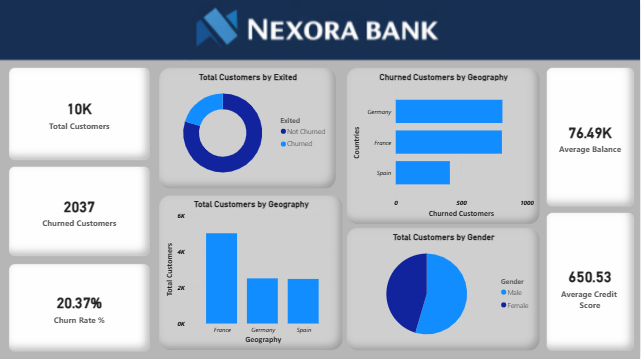
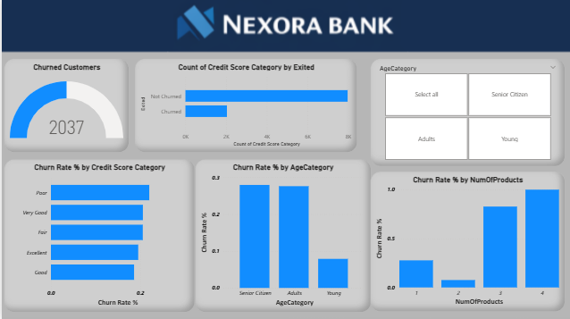
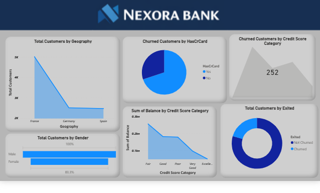
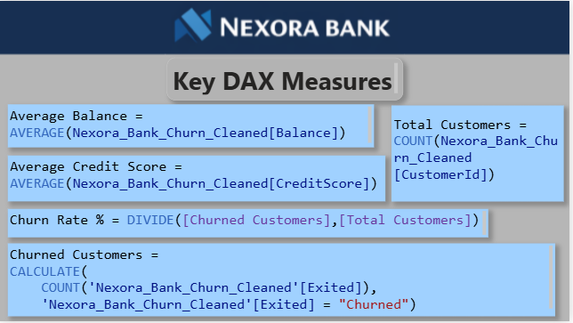

📊 Nexora Bank Customer Churn Analysis

📌 Project Overview

Analyzed customer churn patterns for Nexora Bank (an imaginary bank).

Objective: Identify factors influencing customer churn and help the bank improve customer retention strategies.

Built an interactive dashboard using Microsoft Power BI to transform raw data into meaningful business insights.
______________________________________________________________________________________________________________________________________________________

🧩 Business Problem

Banks often struggle to identify why customers leave their services, which leads to revenue loss and reduced customer lifetime value.

This project analyzes customer data to:

Detect high-risk customer segments

Understand behavior patterns linked to churn

Provide data-driven insights that help improve customer retention.

______________________________________________________________________________________________________________________________________________________

📂 Dataset

Source: Maven Analytics – Maven Datasets

Dataset includes:

👤 Credit Score

🎂 Age

🌍 Geography

💰 Account Balance

🏦 Number of Products

💳 Credit Card Ownership

⚡ Active Member Status

🚪 Churn Status (Exited)
______________________________________________________________________________________________________________________________________________________

🛠 Tools & Technologies

📊 Microsoft Power BI – Dashboard creation & visualization

📑 Microsoft Excel – Data exploration & preparation

🤖 ChatGPT, Gemini, Copilot, – Assisted with project documentation, structuring, and explanation of analytical insights

🔍 Exploratory Data Analysis (EDA)

______________________________________________________________________________________________________________________________________________________

📊 Key Metrics

👥 Total Customers: 10,000

🚪 Churned Customers: 2,037

📉 Churn Rate: 20.37%

💰 Average Balance: 76.49K

⭐ Average Credit Score: 650

______________________________________________________________________________________________________________________________________________________

🔎 Key Insights

👴 Senior customers show higher churn probability.

🌍 Germany has a relatively higher churn rate compared to other regions.

🏦 Customers with multiple banking products still demonstrate churn patterns.

💳 Credit card ownership alone does not guarantee customer retention.

______________________________________________________________________________________________________________________________________________________

💡 Business Value

This analysis helps the bank:

Identify customers most likely to churn

Develop targeted retention campaigns

Improve customer experience and loyalty

Make data-driven business decisions

______________________________________________________________________________________________________________________________________________________

## 📊 Power BI Dashboard Preview

### Overview

### Customer Behaviour Analysis

### Financial Risk Analysis

### DAX Measures

